## Architecture Overview

Funiq Trading uses a layered, modular architecture that implements a full front-end/back-end separation. The system exposes services via HTTP and C interfaces, allowing client development to be completely decoupled from the core business logic. This design provides flexible integration options while ensuring that core strategies run in a high-performance environment and are not affected by the network layer.

### Core Design Principles

- Front-end and back-end fully separated: clients call standard interfaces and are not tied to a specific language or platform
- Pluggable architecture: core systems such as market data, trading, strategy, and backtesting can be independently replaced or extended
- Performance-first: strategies run directly in the core layer to avoid network overhead; current latency is stable at microsecond level
- Language-agnostic: C and HTTP interfaces support most programming languages
- Clear layering: responsibilities are separated across network layer, core business layer, and infrastructure layer for easier maintenance and extension

## Overall Architecture

### System Layers

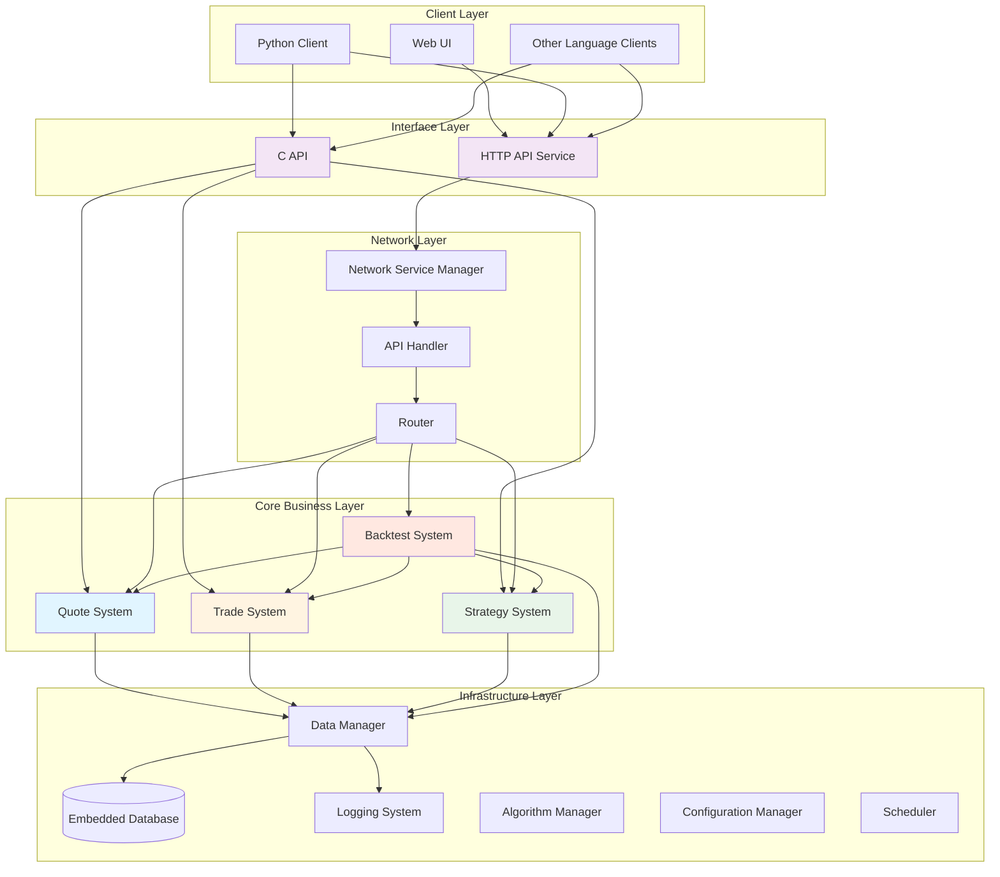

### Architecture Notes

The system uses a three-layer architecture:

1. Network Layer (Interface Layer)
   - Responsible for exposing external interfaces and handling requests
   - Supports HTTP RESTful API and C function calls
   - Contains no business logic; only request forwarding and response wrapping

2. Core Business Layer
   - Contains four core systems: Quote, Trade, Strategy, and Backtest
   - All core business logic executes in this layer
   - Guarantees high performance and low latency
   - Systems may call each other (e.g., backtest calling quote/trade/strategy)

3. Infrastructure Layer
   - Provides data storage, logging, configuration management, scheduling, algorithms, and other foundational capabilities
   - Supports the core business layer
   - Includes database, logging, configuration, scheduling, algorithm components

## Core Systems Detailed

### 1. Quote System

The quote system is responsible for market data ingestion, processing, distribution, and replay.

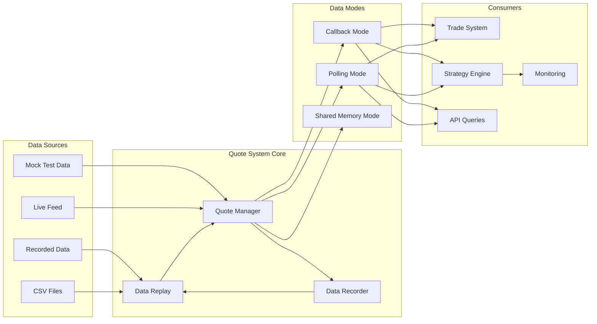

#### Key Features

Pluggable data sources
- All data sources connect via a unified interface
- Data structures are abstracted to be compatible with various third-party APIs

Multiple data origins
- Mock data: for local testing
- Recorded data: real-time feed can be recorded for later replay
- CSV import: supports bulk historical data import
- Live feed: connects to exchange or market data gateway

Three data read modes

| Mode | Use case | Notes |
|------|---------|-------|
| Callback Mode | Event-driven strategies | Pushes data to strategies when it arrives |
| Polling Mode | Periodic query strategies | Strategies pull data at fixed intervals |
| Shared Memory Mode | Ultra-low latency scenarios | Zero-copy transfer (experimental) |

Data recording & replay
- Recording: live market data may be recorded to local DB or files
- Replay: historical data can be replayed along a timeline for backtesting and verification

### 2. Trade System

The trade system is responsible for order management, trade execution, and account/funds queries.

```mermaid
graph TB
	subgraph "Trade Requests"
		APIRequest[HTTP/C API Request]
		StrategyOrder[Strategy Order]
	end
    
	subgraph "Trade System Core"
		OrderManager[Order Manager]
		TradeEngine[Trade Engine]
		OrderRouter[Order Router]
	end
    
	subgraph "Trading Channels (Clearing Systems)"
		Channel1[Clearing System A]
		Channel2[Clearing System B]
		Channel3[Clearing System C]
		CounterDB[(Clearing DB)]
	end
    
	subgraph "Strategy Integration"
		StrategySystem[Strategy System]
		AlgoEngine[Algorithm Engine (on-demand)]
		StrategyDB[(Strategy DB)]
	end
    
	APIRequest --> OrderManager
	StrategyOrder --> OrderManager
    
	OrderManager --> TradeEngine
	TradeEngine --> OrderRouter
    
	OrderRouter --> Channel1
	OrderRouter --> Channel2
	OrderRouter --> Channel3
    
	Channel1 --> CounterDB
	Channel2 --> CounterDB
	Channel3 --> CounterDB
    
	StrategySystem -.integrates.-> AlgoEngine
	StrategySystem --> StrategyDB
	StrategySystem --> OrderManager
    
	TradeEngine -.queries.-> CounterDB
```

#### Key Features

Pluggable trading channels
- Connects to different clearing/trading channels
- Unified order structure and workflow

Order management
- Routing and distribution
- Order state tracking and querying
- Order data queries: direct queries to clearing systems for orders, fills, positions, funds

Algorithm engine (in infrastructure layer)
- Hosted in the infrastructure layer and called on-demand
- Algorithms like TWAP are commonly used inside strategies
- Provides generic slicing/execution logic that strategies can call

Data management notes
- Clearing DB: managed by the trading channel, stores actual orders, trades, positions
- Strategy DB: managed by the strategy system, stores strategy-related orders
- Trade system queries clearing systems via query interfaces for required data

Risk control (planned)
- No unified risk module implemented yet
- Risk logic can be implemented within strategies
- Supported checks in strategies:
  - Pre-order validation
  - Funds and position limits
  - Custom risk rules

### 3. Strategy System

The strategy system is the key component of the core business layer, supporting multiple strategies running in parallel and customization.

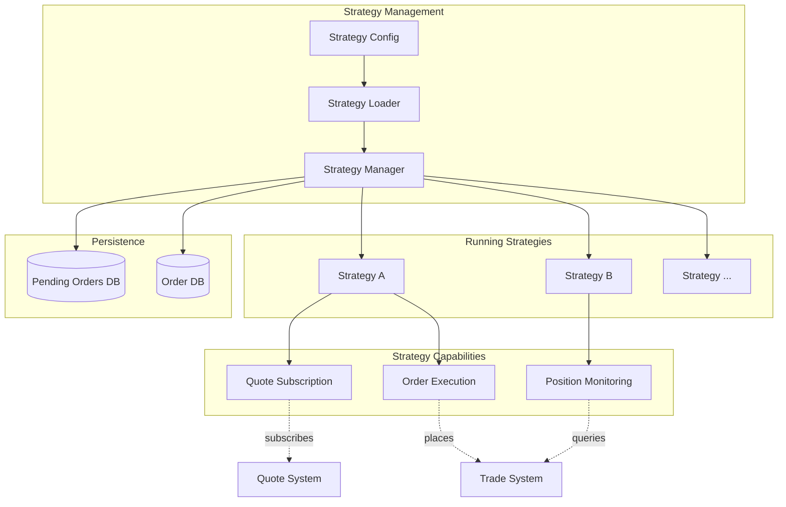

#### Key Features

Pluggable strategy architecture
- Strategies are independent modules loaded dynamically
- Unified strategy interface specification
- Support dynamic load and unload

Multi-strategy concurrency
- Multiple strategies can run concurrently
- Resource isolation between strategies
- Independent performance monitoring and logging

Strategy state persistence
- Strategy config saved to DB
- Pending orders and order info persisted
- Strategy state can be recovered

Customization
- Custom strategy parameters
- Flexible signal generation
- Configurable execution rules

### 4. Backtest System

The backtest system provides historical data replay capability and is the basic infrastructure for strategy validation.

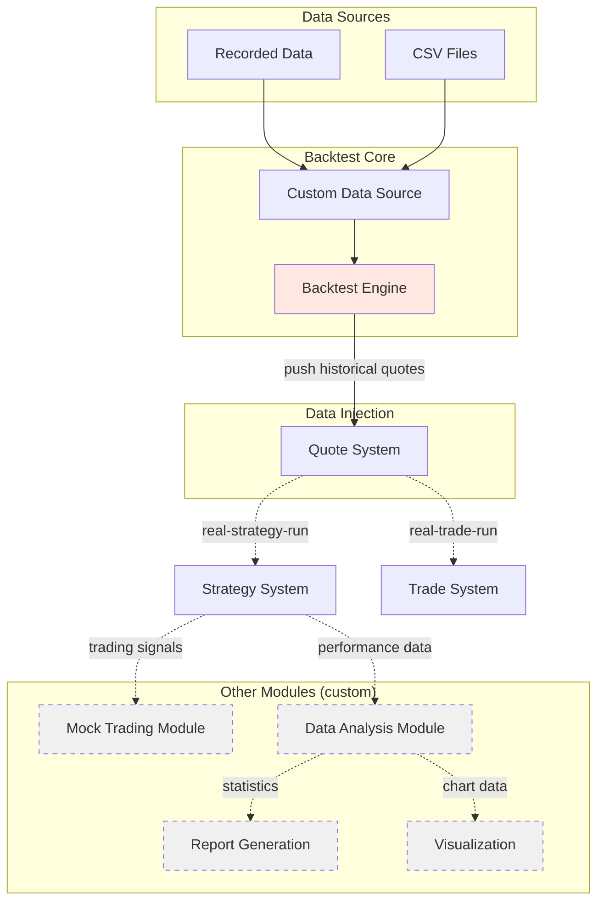

#### Current Implementation

The backtest system is currently at a basic stage and provides the core data replay capability:

Implemented features
- ✅ Custom data source integration: flexible configuration of historical data sources
- ✅ Data push into quote system: historical data is pushed into the quote system in chronological order
- ✅ Support multiple data formats: recorded market data and CSV historical data

How it works
1. The backtest engine loads historical data from various sources
2. It pushes data to the quote system in chronological order
3. The quote system distributes data to strategies (same process as live)
4. Strategy logic runs identically to live trading

Key advantages
- Strategy code reuse: backtesting uses the same strategy code as live
- Realistic process verification: data flow is consistent with live trading
- Flexible data sources: supports multiple historical data formats

Typical backtest flow
1. Configure data source (recorded/CSV/DB)
2. Initialize backtest engine with time range and filters
3. Start data push: engine injects historical data into the quote system
4. Strategies run automatically and produce results

## Interface Layer Design

The system provides two interface modes to meet different needs.

### HTTP API

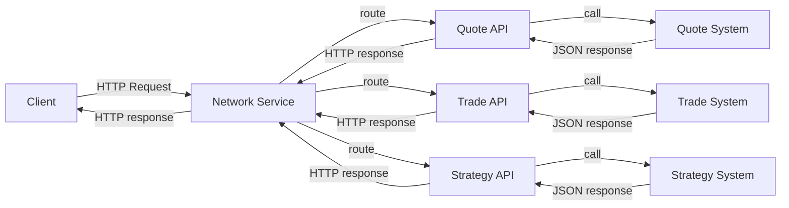

#### Characteristics
- Cross-language support: any language that supports HTTP can call the APIs
- Easy integration: RESTful style and JSON
- Firewall-friendly: uses standard HTTP
- Easy to debug: testable with curl, Postman, etc.

Implementation location (notes)
- Network services: `src/network/`
- API handlers: `src/network/handler/http/`
  - `quote_api_handler.cpp` - quote interface
  - `trade_api_handler.cpp` - trade interface
  - `strategy_api_handler.cpp` - strategy interface

### C API

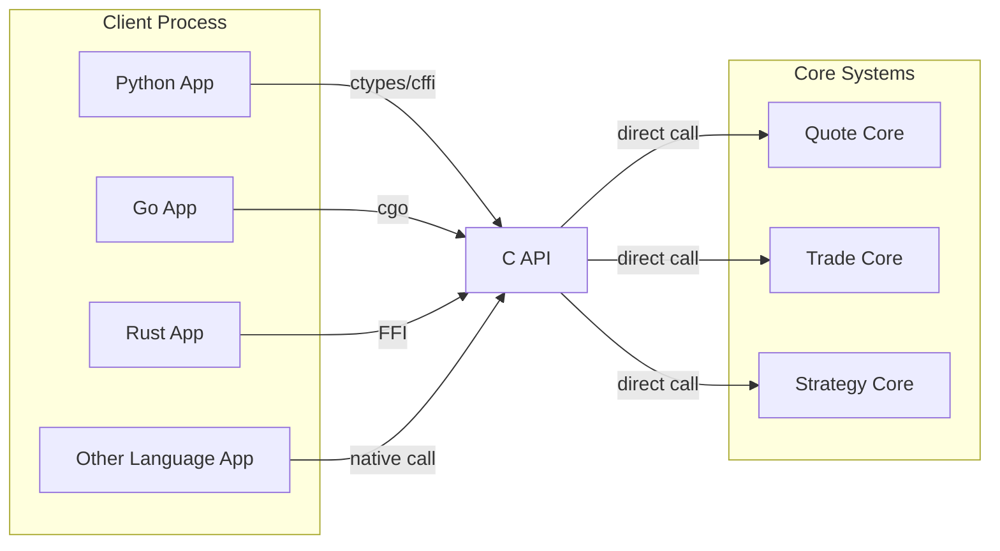

#### Characteristics
- Extreme performance: direct function calls with no network overhead
- Language-agnostic: C ABI is a common denominator for many languages
- In-process calls: embed core logic in client processes
- Low latency: suitable for high-frequency scenarios

Use cases
- Low-latency/high-frequency strategies
- Embedded integration (run core logic inside the client process)
- Cross-language calling from Python, Go, Rust, etc.

Advantages summary
- Strategies run in the core layer without network overhead
- C API offers zero-network-call invocation
- HTTP API provides usability and compatibility
- Both interfaces can be used simultaneously without interference

## Infrastructure Layer

The infrastructure layer provides storage, logging, configuration, scheduling, and other services for the core business layer.

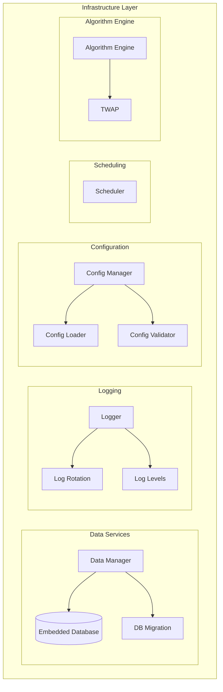

### 1. Data Services

#### Data Management

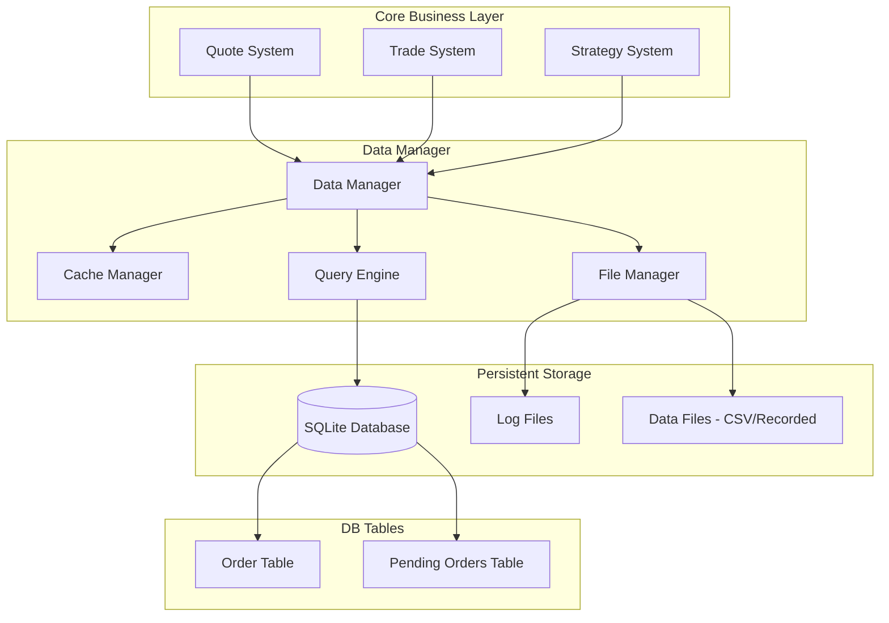

Data manager features
- Unified DB access interface for orders, strategies, etc.
- File system management for reading/writing various data files
  - CSV reading for historical data import
  - Recorded data file management for quote recording/replay
  - Log file management and config file reading
- Cache management for hot data
- Query engine for efficient queries

Embedded DB
- Engine: SQLite (lightweight/no separate service)
- Connection pooling for concurrent access
- Transaction support for data consistency

Database migration
- Migration config file: `migrations/migration.config.ini`
- Migration scripts: `migrations/scripts/`
- Templates: `migrations/templates/`
- Version tracking and automatic current-version recording
- Support upgrade/rollback

### 2. Logging

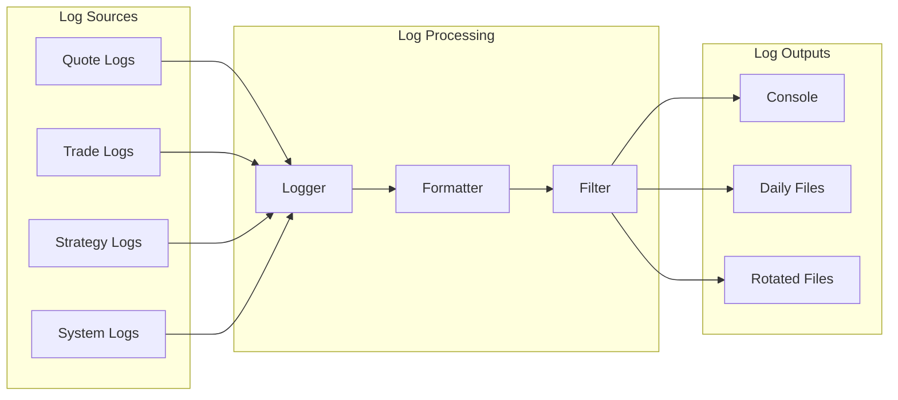

Key features
- Logging library: spdlog
- Levels: trace, debug, info, warn, error, critical
- Multiple outputs: console, files, rotated files
- Asynchronous writing to avoid blocking business logic
- Customizable formats and module-based logs

### 3. Configuration

Config service handles loading, validation, and management of system configs.

Features
- Centralized configuration files
- Startup validation of configuration
- Hot reload for some config (planned)
- Environment separation (dev/test/prod)
- JSON format for readability and maintenance

Main config items
- DB connection params
- Network service ports and addresses
- Log level and output paths
- Quote source config (endpoints, auth)
- Trade interface config
- Thread counts and CPU affinity
- Strategy params and scheduled tasks

### 4. Scheduling

The scheduler controls automatic start/stop of internal services and scheduled tasks.

Features
- System-level auto start/stop of quote, trade, strategy systems
- Timed tasks defined via config

Auto start/stop example

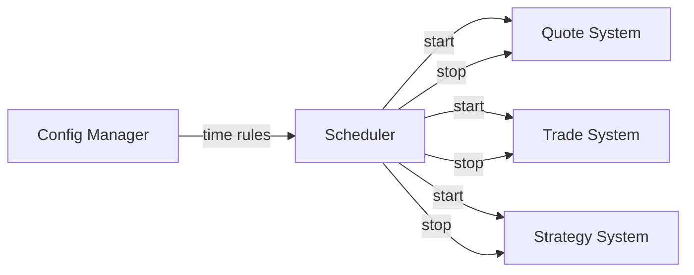

### 5. Algorithm Engine

The algorithm engine lives in the infrastructure layer and provides generic trading algorithms for strategies to call.

Features
- On-demand invocation
- Strategy integration: strategies call algorithms as needed
- Common algorithms provided, e.g., TWAP

Implemented algorithms

| Algorithm | Description | Use case | Status |
|-----------|-------------|----------|--------|
| TWAP | Time-Weighted Average Price | Large order slicing to reduce market impact | ✅ Implemented |

TWAP details
- Goal: split a large order into many small orders spread over a time window
- Advantages: reduce market impact and avoid price anomalies
- Functions:
  - Task creation with symbol, quantity, time window
  - Task control: pause/resume/cancel
  - Status query for progress
  - Automatic execution by time slices

Strategy relationship

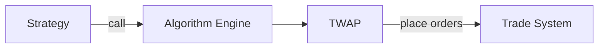

Strategies may choose direct or algorithmic order placement.

## Performance Optimization

### Current Performance

From testing, the system's performance in simple strategy scenarios:
- Latency: stable at microsecond level (µs)
- Throughput: supports high-frequency data processing
- Concurrency: multiple strategies run in parallel

### Optimization directions

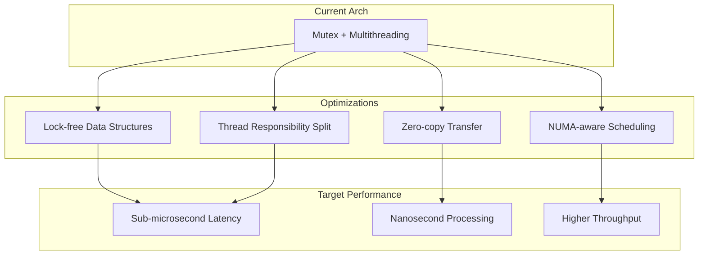

Planned optimizations

1. Lock-free
- Use lock-free queues instead of mutexes
- Optimize critical paths with atomic operations
- Reduce lock contention and context switches

2. Thread splitting
- IO threads: handle network and file IO
- Processing threads: parse and process data
- Strategy threads: strategy computation and signal generation
- Trade threads: order execution and state management

3. Shared memory
- Improve shared memory mode (include/data/shared_memory.h)
- Zero-copy data transfer
- Efficient IPC

4. Thread pool management
- CPU affinity and core binding
- Dedicated cores for critical threads
- Reduce cache thrashing

Performance goals
- General path: sub-microsecond latency
- Critical path: nanosecond-level processing

### Thread & CPU affinity

Current support
- Thread counts configurable via config
- CPU affinity for critical threads

## Security Considerations

- Risk control: no unified risk module yet; strategies can implement their own (planned)
- Access control: API access control (planned)
- Data encryption: sensitive data encryption at rest (planned)
- Audit logs: full operation logging

## Monitoring & Operations

- Log monitoring via log files
- Performance monitoring for critical paths
- Alerting on exceptions and errors
- Health checks: API health endpoints
