## 架构概述

Funiq Trading 采用分层式、模块化的架构设计，实现了**完整的前后端分离**。系统通过 HTTP 接口和 C 接口对外提供服务，使得客户端开发完全独立于核心业务逻辑。这种设计不仅提供了灵活的集成方式，还保证了核心策略在高性能环境下运行，不受网络层的影响。

### 核心设计理念

- **前后端完全分离**：客户端通过标准接口调用，不依赖特定语言或平台
- **可插拔式架构**：行情、交易、策略、回测等核心系统均可独立替换和扩展
- **高性能优先**：策略在核心层直接运行，避免网络开销，当前延迟稳定在微秒级
- **语言无关**：通过 C 接口和 HTTP 接口支持绝大多数编程语言集成
- **分层清晰**：网络层、核心业务层、基础服务层职责明确，便于维护和扩展

## 整体架构

### 系统分层

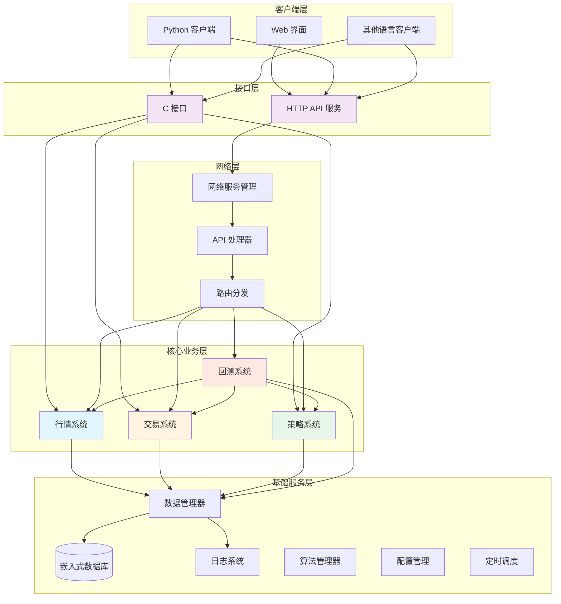

### 架构说明

系统采用**三层架构**：

1. **网络层（Interface Layer）**
   - 负责对外接口暴露和请求处理
   - 支持 HTTP RESTful API 和 C 函数调用两种方式
   - 不包含业务逻辑，仅做请求转发和响应封装

2. **核心业务层（Core Business Layer）**
   - 包含行情、交易、策略、回测四大核心系统
   - 所有核心业务逻辑在此层执行
   - 保证高性能和低延迟
   - 系统间可相互调用（如回测系统调用行情、交易、策略）

3. **基础服务层（Infrastructure Layer）**
   - 提供数据存储、日志记录、配置管理、定时调度、算法等基础能力
   - 为核心业务层提供支撑服务
   - 包含数据库、日志、配置、调度、算法等通用组件

## 核心系统详解

### 1. 行情系统（Quote System）

行情系统负责市场数据的接入、处理、分发和回放。

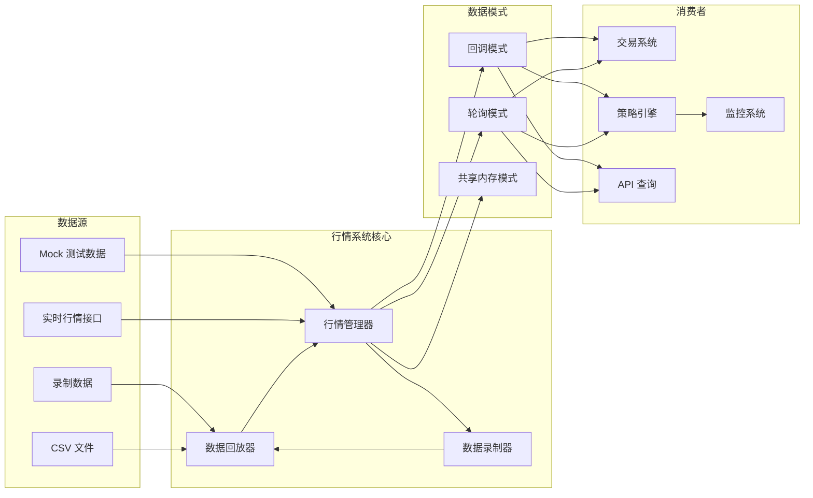

#### 核心特性

**可插拔式数据源**
- 所有数据源通过统一接口接入
- 数据结构抽象化，兼容各类三方平台 API

**多种数据来源**
- **Mock 数据**：用于本地测试
- **录制数据**：实时行情可录制保存，用于后续回放
- **CSV 导入**：支持大批量历史数据导入
- **实时接口**：对接交易所或行情网关的实时数据流

**三种数据读取模式**

| 模式 | 适用场景 | 特点 |
|------|---------|------|
| **回调模式** | 事件驱动策略 | 数据到达时主动推送给策略 | 
| **轮询模式** | 定时查询策略 | 策略按固定频率主动拉取数据 | 
| **共享内存模式** | 极低延迟场景 | 零拷贝数据传输（测试中） |

**数据录制与回放**
- **录制功能**：实时行情可录制到本地数据库或文件
- **回放功能**：历史数据按时间轴回放，用于策略回测和验证

### 2. 交易系统（Trade System）

交易系统负责订单管理、交易执行和资金查询。

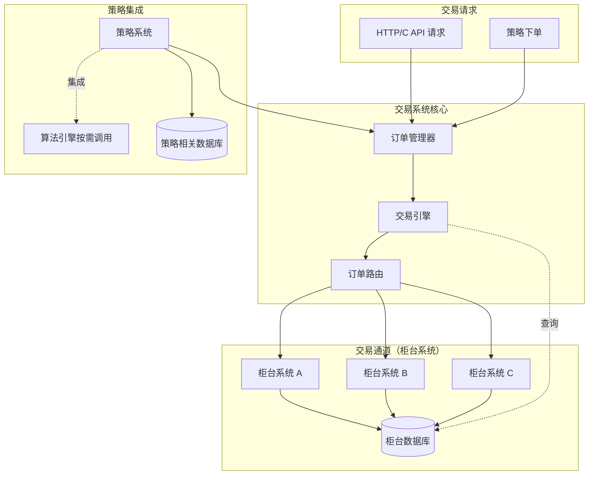

#### 核心特性

**可插拔式交易通道**
- 对接不同的柜台系统（交易通道）
- 统一的订单结构和交易流程

**订单管理**
- 订单路由和分发
- 订单状态跟踪和查询
- **订单数据查询**：直接从柜台系统（交易通道）查询订单、成交、持仓、资金等数据

**算法引擎（基础架构层）**
- 算法引擎位于基础架构层，按需调用
- **TWAP 等算法通常集成在策略中使用**
- 算法引擎提供通用的拆单、执行逻辑
- 策略可根据需要灵活调用

**数据管理说明**
- **柜台系统数据库**：由交易通道（柜台系统）管理，存储实际订单、成交、持仓数据
- **策略相关数据库**：策略系统管理，存储策略的挂单和订单信息
- 交易系统通过查询接口从柜台系统获取所需数据

**风控系统（规划中）**
- 当前系统未实现统一的风控模块
- 风控逻辑可在策略层自行开发
- 支持在策略中实现：
  - 订单前置检查
  - 资金和持仓限制
  - 自定义风控规则

### 3. 策略系统（Strategy System）

策略系统是核心业务层的关键组成，支持多策略并行运行和个性化定制。

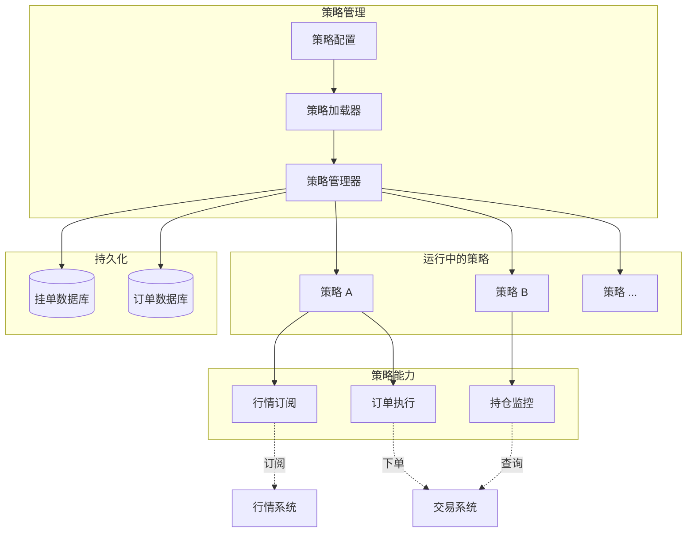

#### 核心特性

**可插拔式策略架构**
- 策略作为独立模块加载
- 统一的策略接口规范
- 支持动态加载和卸载

**多策略并行**
- 支持多个策略同时运行
- 策略间资源隔离
- 独立的性能监控和日志

**策略状态持久化**
- 策略配置保存到数据库
- 挂单、订单信息持久化
- 策略状态可恢复

**个性化定制**
- 支持自定义策略参数
- 灵活的信号生成逻辑
- 可配置的执行规则

### 4. 回测系统（Backtest System）

回测系统提供历史数据回放能力，是策略验证的基础设施。

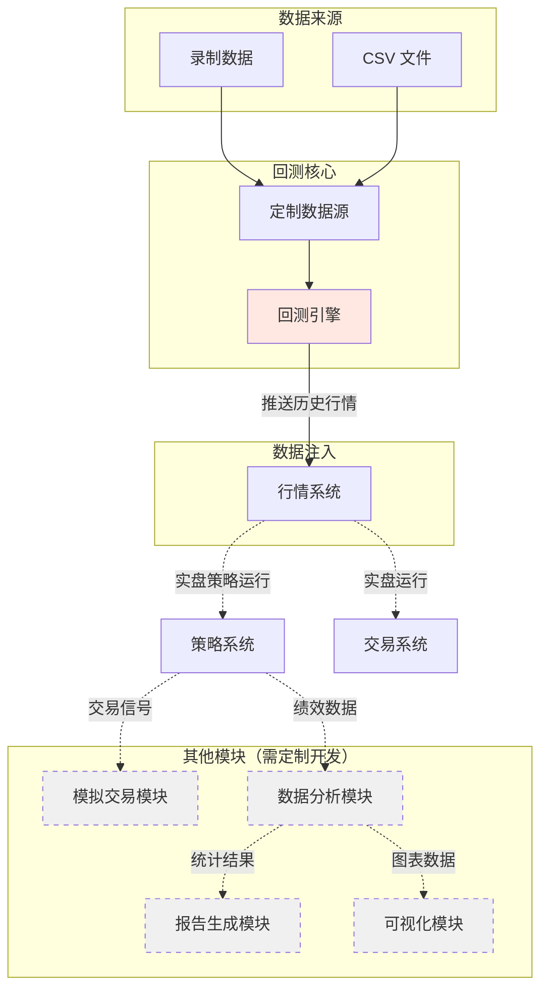

#### 当前实现

回测系统目前处于**基础阶段**，提供核心的数据回放能力：

**已实现功能**
- ✅ **定制数据源接入**：支持灵活配置历史数据来源
- ✅ **数据推送到行情系统**：将历史数据按时间顺序推入行情系统
- ✅ **多种数据格式支持**：
  - 录制的行情数据
  - CSV 格式的历史数据

**核心工作原理**

回测引擎的主要职责是**作为数据源桥接器**：
1. 从各种来源加载历史数据
2. 按时间顺序将数据推送到行情系统
3. 行情系统将数据分发给策略（与实盘流程一致）
4. 策略运行的逻辑与实盘完全相同

**关键设计优势**
- **策略代码复用**：回测时使用与实盘完全相同的策略代码
- **真实流程验证**：数据流与实盘一致，确保回测有效性
- **灵活数据源**：支持多种历史数据格式和来源

#### 典型回测流程

1. **配置数据源**：选择历史数据来源（录制数据/CSV/数据库）
2. **初始化回测引擎**：设置时间范围、数据过滤条件
3. **启动数据推送**：回测引擎将历史数据推入行情系统
4. **策略自动运行**：交易、策略接收历史行情，执行交易逻辑

## 接口层设计

系统提供两种接口方式，满足不同场景的需求。

### HTTP API 接口

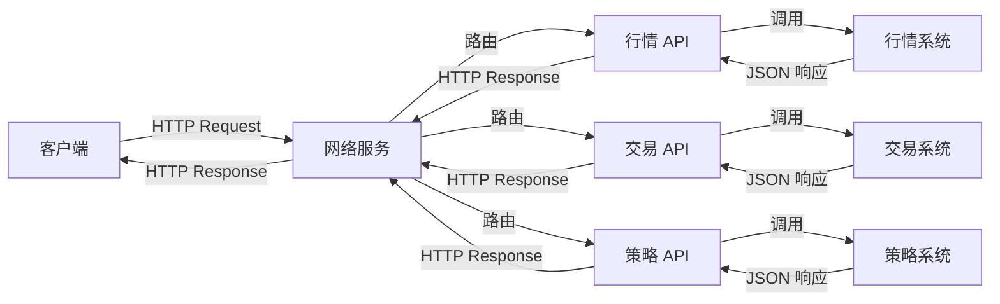

#### 特点

- **跨语言支持**：任何支持 HTTP 的语言均可调用
- **易于集成**：RESTful 风格，标准 JSON 格式
- **防火墙友好**：使用标准 HTTP 协议
- **便于调试**：可使用 curl、Postman 等工具测试

#### 实现位置

- 网络服务：`src/network/`
- API 处理器：`src/network/handler/http/`
  - `quote_api_handler.cpp` - 行情接口
  - `trade_api_handler.cpp` - 交易接口
  - `strategy_api_handler.cpp` - 策略接口

### C 接口

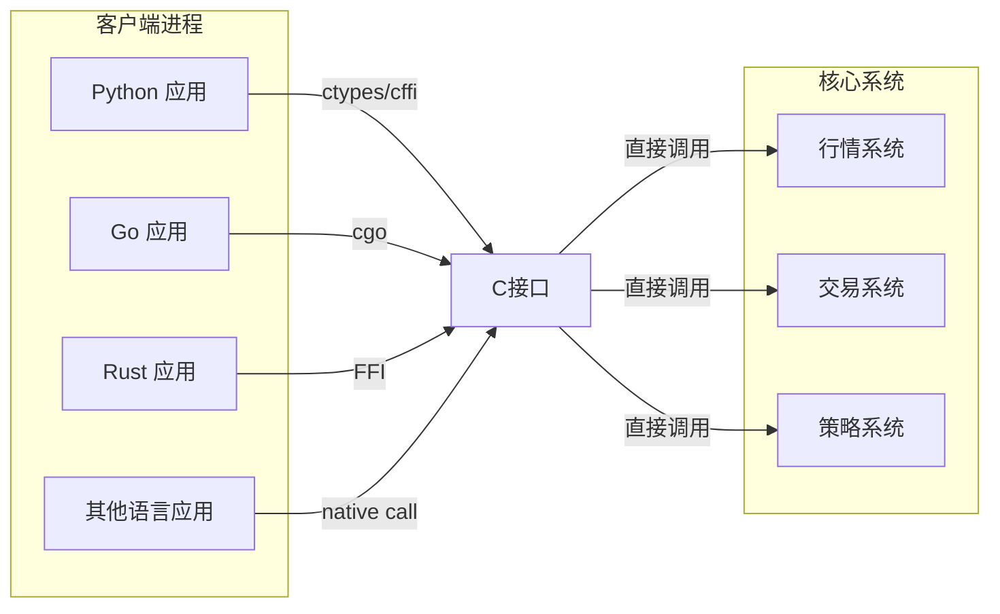

#### 特点

- **极致性能**：直接函数调用，无网络开销
- **语言无关**：C ABI 是各语言的通用标准
- **进程内调用**：可嵌入到客户端进程中运行
- **低延迟**：适合高频策略场景

#### 使用场景

- 高频策略：对延迟要求极高的场景
- 嵌入式集成：需要在客户端进程内运行核心逻辑
- 跨语言调用：从 Python、Go、Rust 等语言调用 C++ 核心

**关键设计优势**：
- 策略运行在核心层，不受网络层影响
- C 接口提供零网络开销的调用方式
- HTTP 接口保证易用性和兼容性
- 两种接口可同时使用，互不干扰

## 基础服务层

基础服务层为核心业务层提供数据存储、日志记录、配置管理、定时调度等支撑能力。

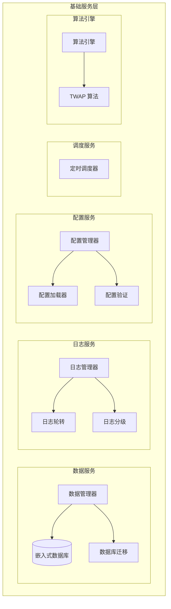

### 1. 数据服务

#### 数据管理

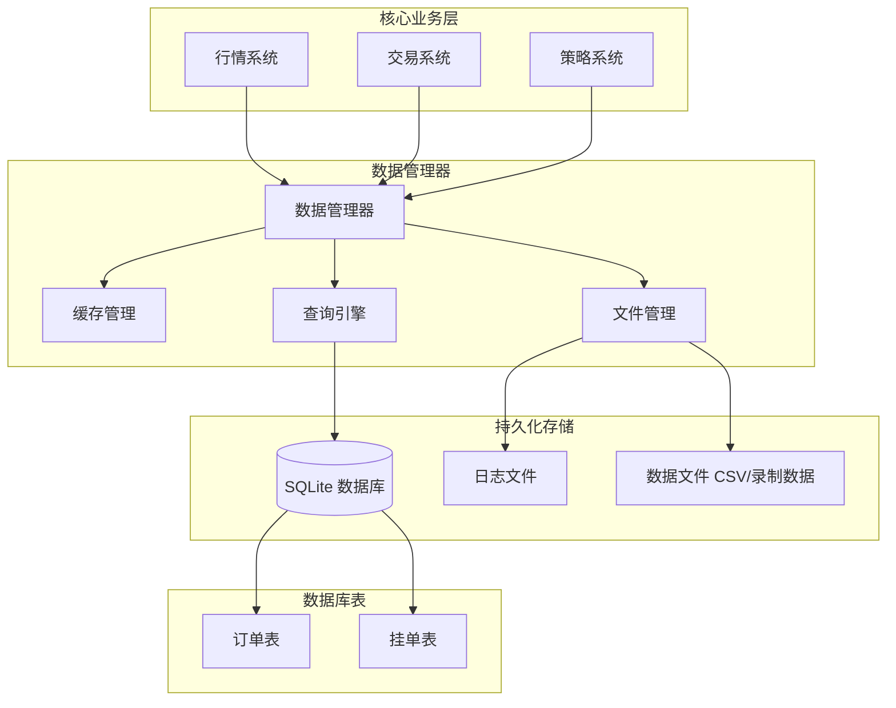

**数据管理器功能**
- **数据库访问**：统一的数据库访问接口，支持订单、策略等数据管理
- **文件系统管理**：负责读取和写入各类数据文件
  - CSV 文件读取（历史行情数据导入）
  - 录制数据文件管理（行情录制与回放）
  - 日志文件管理
  - 配置文件读取
- **缓存管理**：热点数据缓存，提升访问性能
- **查询引擎**：提供高效的数据查询能力

**嵌入式数据库**
- **数据库引擎**：SQLite（轻量级、无需独立服务）
- **连接池**：支持多连接并发访问
- **事务支持**：确保数据一致性

**数据库版本管理**

系统内置数据库迁移（Migration）机制：
- **配置文件**：`migrations/migration.config.ini`
- **迁移脚本**：`migrations/scripts/`
- **模板文件**：`migrations/templates/`
- **版本跟踪**：自动记录当前数据库版本
- **升级/回滚**：支持数据库结构升级和回滚

### 2. 日志服务

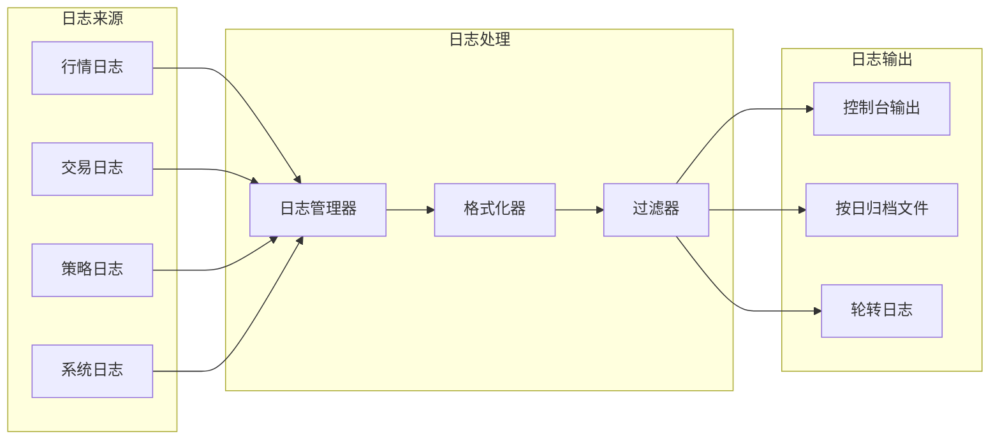

**核心特性**
- **日志库**：spdlog
- **分级日志**：trace、debug、info、warn、error、critical
- **多输出**：控制台、文件、轮转文件
- **异步写入**：不阻塞业务逻辑
- **格式化**：支持自定义日志格式
- **按模块分类**：行情日志、交易日志、策略日志、系统日志

### 3. 配置服务

配置服务负责系统配置的加载、验证和管理。

**核心特性**
- **集中配置**：统一的配置文件管理
- **配置验证**：启动时验证配置合法性
- **热更新**：部分配置支持运行时更新（规划中）
- **环境区分**：支持开发、测试、生产环境配置
- **配置格式**：JSON 格式，易于阅读和维护

**主要配置项**
- 数据库连接参数
- 网络服务端口和地址
- 日志级别和输出路径
- 行情源配置（接口地址、认证信息等）
- 交易接口配置
- 线程数量和 CPU 绑核设置
- 策略参数和定时任务

### 4. 调度服务

调度服务是系统自动化运行的核心，负责**整个系统内部服务的自动启停和定时任务调度**。

**核心特性**
- **系统级自动启停**：自动控制行情系统、交易系统、策略系统等核心服务的启动和停止
- **定时任务**：通过配置文件定义定时规则

**系统自动启停机制**

调度服务可以根据配置的时间规则，自动控制各个核心系统的生命周期：

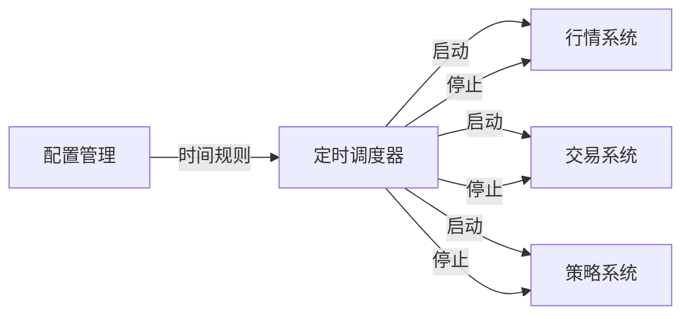

### 5. 算法引擎

算法引擎位于基础服务层，提供通用的交易算法实现，供策略按需调用。

**核心特性**
- **按需调用**：算法引擎不在交易核心中，而是作为独立服务供策略调用
- **策略集成**：通常集成在策略中使用，灵活组合
- **通用算法**：提供 TWAP 等常见交易算法实现

**已实现算法**

| 算法 | 说明 | 使用场景 | 实现状态 |
|------|------|---------|---------|
| **TWAP** | 时间加权平均价格算法 | 大单拆分，降低市场冲击 | ✅ 已实现 |

**TWAP 算法详解**

时间加权平均价格（Time-Weighted Average Price）算法：
- **目标**：将大单拆分为多笔小单，在指定时间段内均匀执行
- **优势**：降低对市场价格的冲击，避免引起价格异常波动
- **功能**：
  - 任务创建：指定股票、数量、时间段等参数
  - 任务控制：支持暂停、恢复、取消
  - 状态查询：实时查询执行进度和状态
  - 自动执行：按时间片自动下单

策略可以灵活选择是否使用算法引擎：
- **直接下单**：策略直接调用交易系统下单
- **算法下单**：策略通过算法引擎间接下单，享受算法的拆单、优化等能力

## 性能优化

### 当前性能

根据实际测试，系统在简单策略场景下的性能指标：

- **延迟**：稳定在微秒级（µs）
- **吞吐**：支持高频数据处理
- **并发**：多策略并行运行

### 优化方向

系统仍有较大的优化空间，特别是在高并发场景下：

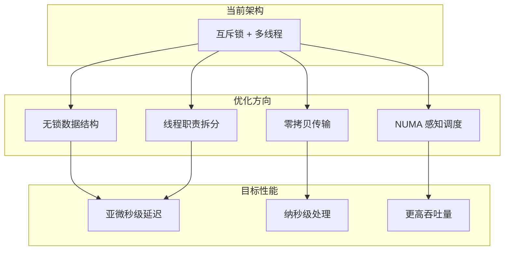

#### 计划中的优化

**1. 无锁化（Lock-Free）**
- 使用无锁队列替代互斥锁
- 原子操作（atomic）优化关键路径
- 减少锁竞争和上下文切换

**2. 线程拆分**
- **IO 线程**：专门处理网络和文件 IO
- **处理线程**：数据解析和业务逻辑
- **策略线程**：策略计算和信号生成
- **交易线程**：订单执行和状态管理

**3. 共享内存优化**
- 完善共享内存模式
- 零拷贝数据传输
- 进程间高效通信

**4. 线程池管理**
- CPU 核心绑定（CPU affinity）
- 关键线程独占核心
- 减少缓存抖动（Cache thrashing）

#### 性能目标

通过上述优化，预期系统延迟可降至：
- **常规路径**：亚微秒级（sub-microsecond）
- **关键路径**：纳秒级（nanosecond）

### 线程与绑核管理

系统当前支持基本的线程管理和 CPU 绑核功能：

- **线程数配置**：可通过配置文件设置
- **CPU 绑核**：关键线程可绑定到特定 CPU 核心

## 安全性考虑

- **风控系统**：当前未实现统一风控，可在策略层自行开发（规划中）
- **权限控制**：API 访问权限管理（规划中）
- **数据加密**：敏感数据加密存储（规划中）
- **审计日志**：完整的操作日志记录

## 监控与运维

- **日志监控**：通过日志文件监控系统运行状态
- **性能监控**：关键路径性能指标记录
- **异常告警**：错误日志和异常捕获
- **健康检查**：API 健康检查接口
